#### Встановлення з'єднання з БД від імені користувача-адміністратора

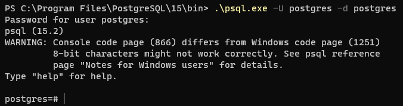 

#### Створення нового користувача

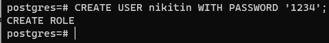 

#### Створення нової ролі

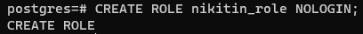 

#### Створення таблиці за варіантом

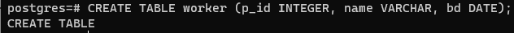 

#### Внесення рядку до таблиці

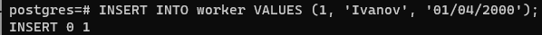 

#### Встановлення з'єднання з БД від імені нового користувача

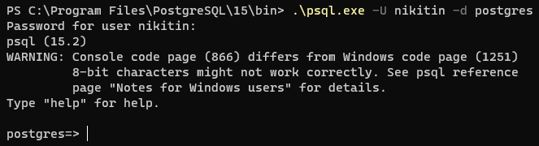 

#### Запит на отримання рядків з таблиці. Можна побачити, що виникає помилка, бо користувач не має прав до роботи з цією таблицею.

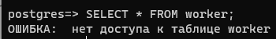 

#### Встановлення повноваження на читання таблиці новому користувачеві

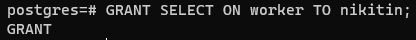 

#### Запит на отримання рядків з таблиці. Після встановлення повноваження, операція виконується.

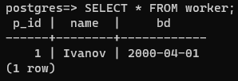 

#### Видалення повноваження на отримання рядків з таблиці.

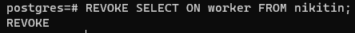 

#### Запит на отримання рядків з таблиці. Можна побачити, що виникає помилка, бо користувач не має прав до роботи з цією таблицею

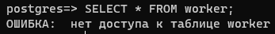 

#### Запит на оновлення рядків в таблиці. Можна побачити, що виникає помилка, бо користувач не має повноваження для оновлення цієї таблиці

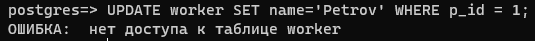 

#### Встановлення повноваження на оновлення таблиці новому користувачеві

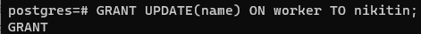 

#### Запит на оновлення рядків в таблиці. Можна побачити, що виникає помилка, бо користувач не має повноваження на читання цієї таблиці

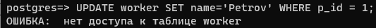 

#### Встановлення повноваження на читання таблиці новому користувачеві

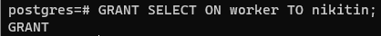 

#### Запит на оновлення рядків в таблиці

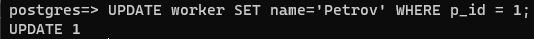 

#### Запит на видалення рядків в таблиці. Можна побачити, що виникає помилка, бо користувач не має повноваження на видалення інформації з цієї таблиці

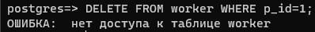 

#### Встановлення повноваження на видалення з таблиці новому користувачеві

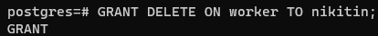 

#### Запит на видалення рядків в таблиці

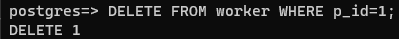 

#### Видалення усіх повноважень з таблиці для нового користувача

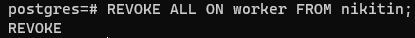 

#### Запит на додання нового рядку в таблицю. Можна побачити, що виникає помилка, бо користувач не має повноваження на додавання інформації в цю таблицю

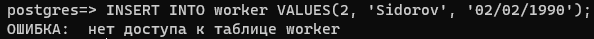 

#### Встановлення повноваження на додання нового рядку в таблицю новому користувачеві

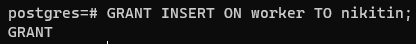 

#### Запит на додання нового рядку в таблицю

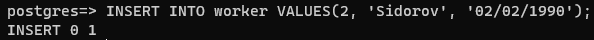 
