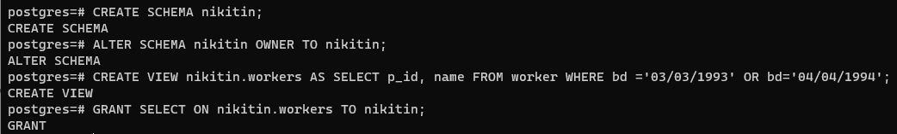

#### Заповнення таблиці БД ще трьома рядками.

 

#### Створення схеми даних та віртуальної таблиці

 

#### Встановлення з'єднання з БД від імені нового користувача

 

#### Перевірка роботи вибіркового керування

 

#### Створення INSERT/UPDATE/DELETE-правил обробки операцій редагування віртуальної таблиці.

 

#### Перевірка роботи вибіркового керування

 