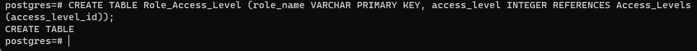
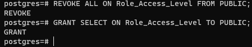
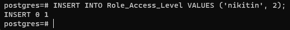
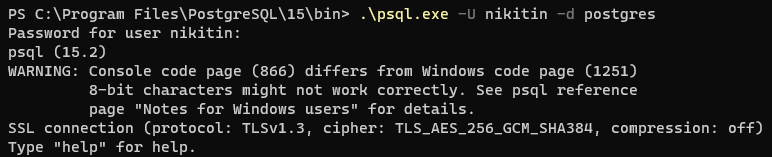

#### 1. Створення у БД структур даних, необхідних для роботи повноважного керування доступом

 
 
 
 

#### 2. Додання до таблиці з даними стовпчик, який буде зберігати мітки конфіденційності

 
 

#### 3. Визначення рівню доступа користувача

 

#### 4. Створення нової схеми даних

 

#### 5. Створення віртуальної таблиці, яка забезпечує SELECT-правила повноважного керування доступом для користувача

 
 

#### 6. Створення INSERT/UPDATE/DELETE-правил повноважного керування доступом для користувача

 

#### 7. Встановлення з’єднання з СКБД від імені нового користувача.

 

#### 8. Перевірка роботи механізму повноважного керування, виконуючи операції SELECT, INSERT, UPDATE, DELETE від імені нового користувача

 