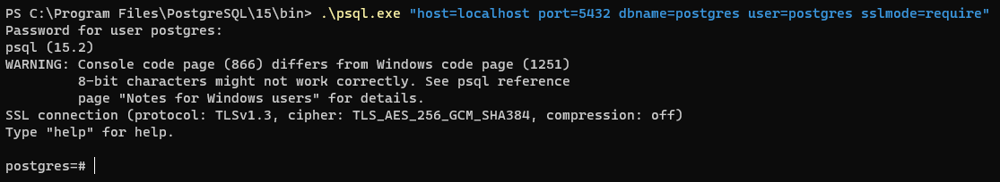

### Встановлення TSL/SSL-з'єднання з БД

#### Версія TLS - 1.3

#### Криптоалгоритми - TLS та криптоалгоритм симетричного шифрування AES із 256-бітним ключем та режимом аутентифікаційного шифрування на основі лічильника з аутентифікацією Галуа, а також алгоритмом хешування SHA із 384-бітами

